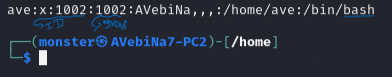
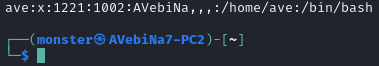
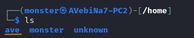
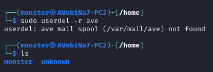
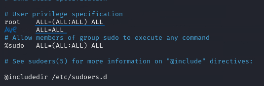
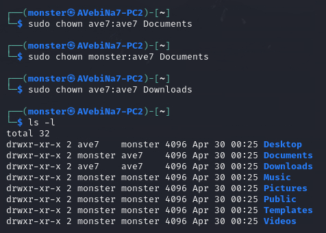
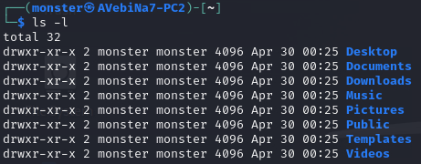
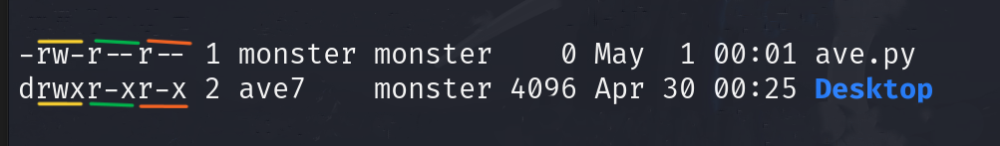

## Advanced Linux Commands

### Privious Class 

###### [[Day_1]]
###### [[Day2_Linux]]
###### [[Day3_linuxUSER]]
###### [[Day4_MoreLinux]]
###### [[Day5_LinuxRUN]]
###### [[Day6_FinalLinux]]

# Content
- Advanced User Commands
- Sudoers File
- Linux File Permission
- CHMOD Commands
- Special File Permissions
- Package Installations
	- apt
	- dpkg

# Advanced Commands
- Whoami - to know the machine name....
- hostname - to know the hoster of the linux or the machine...
- ## __AddingUsers__
	- **useradd** - just simply adding users.... 
		- It's not created in /home
		- It have  **==sh==** shell
		- When you created using useradd, after that to bring the created user into /home Dir
			- use this command "`sudo mkhomedir_helper newuser`" 
	- **adduser** - It some requirments to fill kinda windows ....
		- It's created in /home
		- It have ==**bash**== shell
	- /home - to found where the new user created
	 * cat /etc/passwd to known more information about the users
	
	
	 - To Change user id - use `sudo usermod -u new_id  username`
		 - > e.g- The old user id is 1002 to change this `sudo usermod -u 1221 ave`
	
	
	 * To Delete users 
		 * let's delete this user="ave" 
		 * use this command`sudo userdel -r ave `
		 *    It's Permanently deleted
	 * To Login To another users using  Terminal
		 * use this command `sudo su - new_user`
			 * e.g - `sudo su - unknown`

## Sudoers File

* is when you have permission like 777 or +x this means you don't have permission to run "Sudo"
* if you want to give sudo for the other user use this command `sudo visudo` 
* and edit this line 
* **To Change Terminal **
	*  if the shell is sh to change into bash`sudo usermod new_user -s /bin/bash `  or
	*  when it's bash to change into sh`sudo usermod new_user -s /bin/sh`
#  Linux File Permission

- 2 types of permission on Linux
	1. Owner
	3. Permission
- 5 Main parts of permissions
	1. Permission
	2. Owners
		-  USER
		-  GROUP
		- To change owner of file use this command `chown user:group filename`
		
	1. Size
	2. Date & Time
	3. file-name 
	 
	
# Permission
		 3 Types
1.  Read (r)
2. Write (w)
3. Excute(x)
	* #### AT THE BEGINING 		
		1.  If it have **( d )** It's Folder(Dir)
		2.  If it have ( **-** ) it's File
	### The Permission Still Have 3 Parts
	 1. User (u) -- Power of users on the ownership the 1st ==yellow
	 3. Group (g) -- Power of groups on the ownership
	 4. Other (o) -- Power of other users
	 
	 - To change permission use `chmod <option> filename` 
		 - e.g -- chmod +w Desktop to give permission
		 - or  -- chmod  -x  Desktop to recive back permission