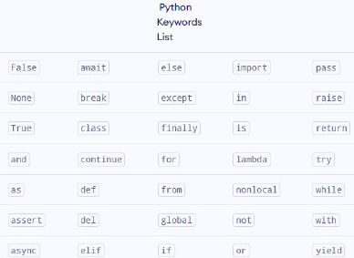

# Introduction:
- How Work High Level Language.....
	1. #Compiler :  CODE --compile-->BYTECODE--excute-->OUTPUT
	2. #Interpreter :CODE --excute--> OUTPUT

# PYTHON: is high level & Interpreted language
### It's simple to read & understand

## History of PYTHON: 
#### is Developed by Guido van Rossum in ninety earlier at N.R.I for mathmatics and Computer Science in the Netherlands...
- PYTHON is drived from other languages and scripting languages
### Uses Of PYTHON : ML,AI,GameDev't,DataAnalysis&Visualization,HackingScripts,BackEnd
* PYTHON is now maintained by a core development team at institute
# IDE,CodeEditor
###  #IDE(Integrated Dev't Env't):IS It helps to write & run for specfic Programming Language Such us for Python
###  #CodeEditor:IS It helps for any Programming Language


# Output & Comment
## Comment
- Single=> use only   **# (Hashtag)**
- Multiple=> use three **single quotes ''' _'''**
### Output : 
- Use ``py``
```py
print(variable sep='' #separation use to separate in every spaces)
# /n --- For New lines
# /t --- For Tab spaces

```

## PythonKeyWords-The're reserved words by the programming languages  


# Variables: isvalue holders(containers) they StoreData
- **The Process of giving value to word is AKA ==ValueDeclaration==**
- **The Word that holds the data is AKA ==_Identifier==**
	``` .py
	ave=7
	print(ave)
	print(f"I'm {ave} years old")  or
	print("I'm" , ave , years old)
	Output= 7
	```

# DataType: 
- Numeric --------  int,float,complex
- String -----------  str
- Sequence --------  list,tuple,range
- Mapping -------  dict
- Boolean -------- bool
- Set --------------set,frothenset

## SequenceData
1. **List :** an ordered collection data saparated by comma enclose within [__]
	E.g: ['abel','mussie,'pesh']
- To Access the items from the list we use index no AKA (0,1,2,3)
-  We can modifies or add using `var.append("add")`
```
core=['abel','mussie,'pesh']
	print(core[0])
	print(core[1])
Output: abel
		mussie
# We can modifies or add
	core.append("yonas")
Output: ['abel','mussie,'pesh','yonas]
	
```

2. **Tuple :** is as same as list the diffrence is It's immutable(Can't modifiy)
		It use circleBrackets-()
```
core=('abel','mussie,'pesh')
	print(core[0])
	print(core[1])
Output: abel
		mussie
```

3. **DictionaryDAta :** is an ordered collectionof items.
	- It have uses key/value pairs
	- It use braceBrackets
```
core=['abel':'pass123','mussie:'passpass','pesh':12212121]
	print(core[abel])
	print(core[mussie])
	print(core[pass123])
Output: pass123
		passpass
		ERROR:keyvalue error
# in this case 
 abel-key
 pass123-value
```
